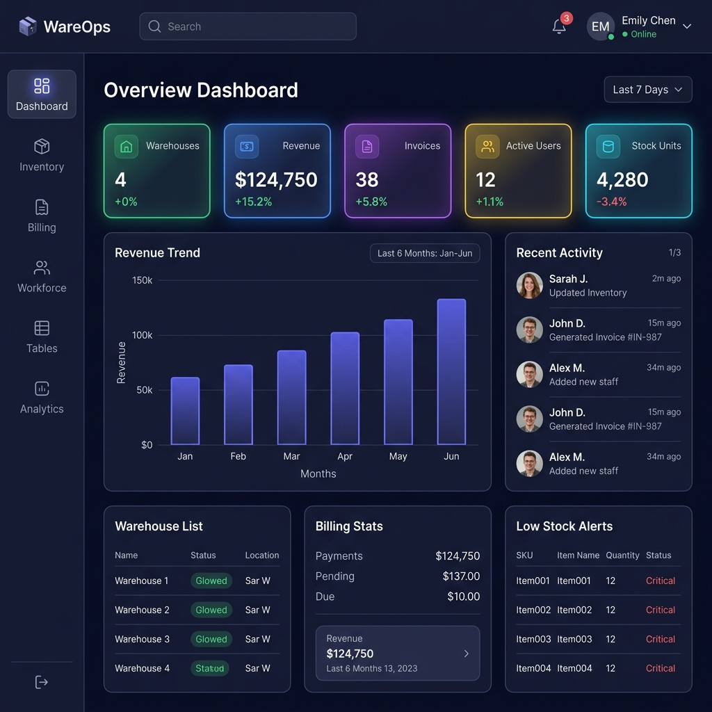
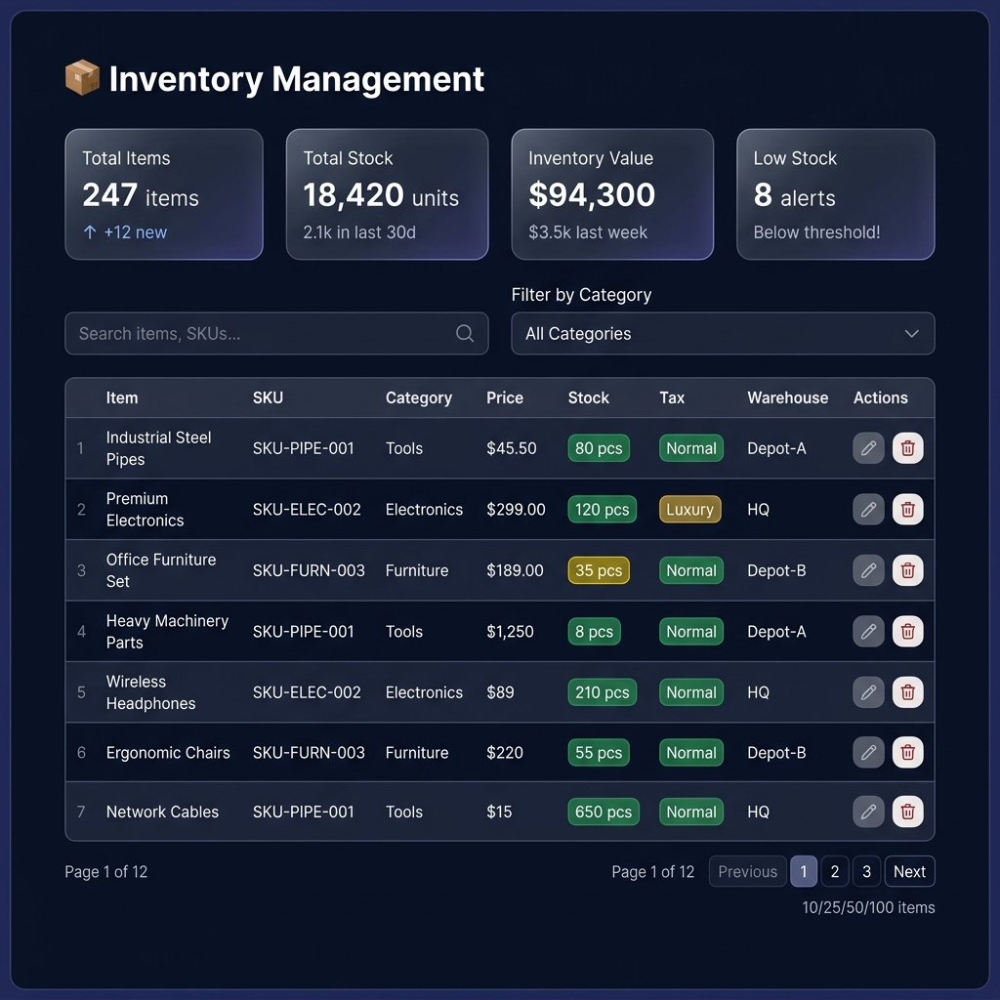
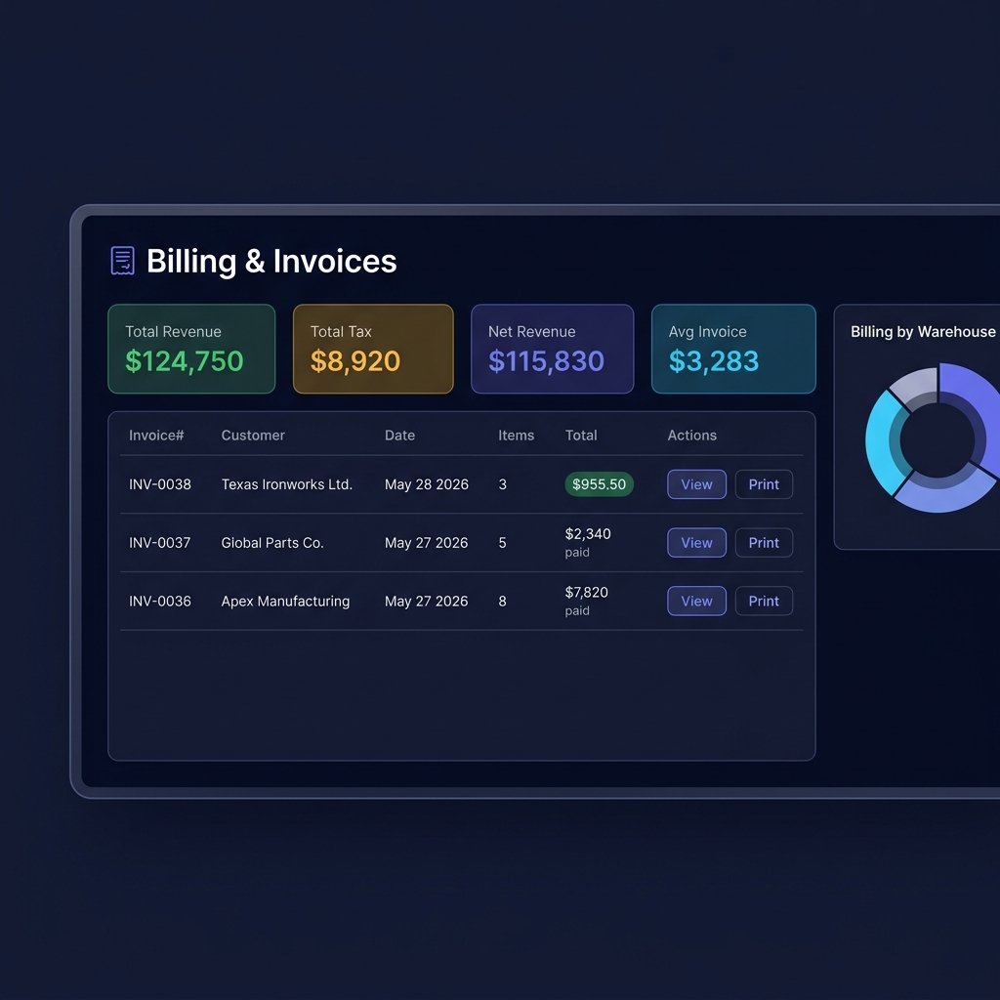
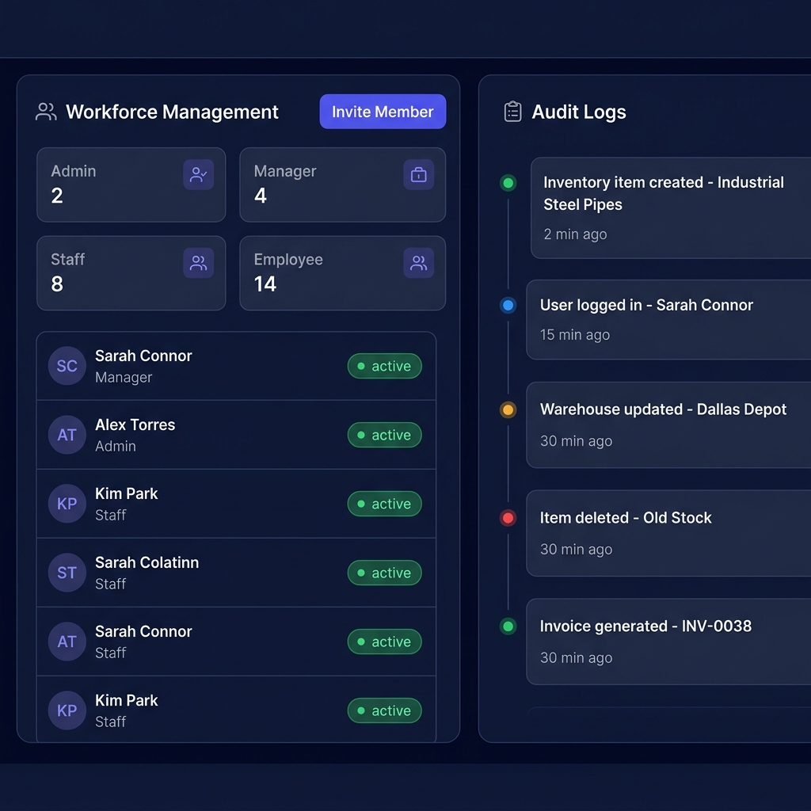

# NexWare ERP — Enterprise SaaS Platform

> 🚀 **Unified Business Operations Platform** — Multi-tenant ERP with workforce management, billing, inventory, dynamic workflows, real-time WebSockets, and a premium SaaS landing page.

---

## 🖥️ Live Preview (Local Development)

| Service | URL | Description |
|:---|:---|:---|
| **Landing Page** | `http://localhost:3000/landing` | Premium SaaS showcase with interactive embedded demo |
| **Dashboard App** | `http://localhost:3000` | Full ERP dashboard (login required) |
| **Backend API** | `http://localhost:8000` | FastAPI REST + WebSocket server |
| **API Docs** | `http://localhost:8000/docs` | Swagger interactive API documentation |
| **Health Check** | `http://localhost:8000/health` | System heartbeat endpoint |

---

## ⚡ Quick Start — Run on Any Device

> **Prerequisites:** [Node.js v18+](https://nodejs.org/) · [Python 3.11+](https://python.org/) · [MongoDB v6+](https://www.mongodb.com/try/download/community) · [Git](https://git-scm.com/)

### Step 1 — Clone Both Repositories

```bash
# Clone the frontend repository
git clone https://github.com/fncreator22/NexWare-ERP.git

# Clone the backend repository
git clone https://github.com/fncreator22/backend-next-ware.git
```

---

### Step 2 — Start MongoDB

Make sure MongoDB is installed and running on your machine before launching the backend.

**Windows (if installed as a service):**
```powershell
# Start MongoDB service
net start MongoDB

# OR start manually if not a service
"C:\Program Files\MongoDB\Server\8.0\bin\mongod.exe" --dbpath "C:\data\db"
```

**Linux / macOS:**
```bash
# Start MongoDB (systemd)
sudo systemctl start mongod

# OR start manually
mongod --dbpath /data/db
```

> 💡 **MongoDB Atlas (Cloud):** If using Atlas, skip this step. Set your `MONGODB_URL` in the backend `.env` file to your Atlas connection string instead.

---

### Step 3 — Setup & Run the Backend (FastAPI)

```bash
# Enter the backend directory
cd backend-next-ware

# Create a Python virtual environment
python -m venv .venv

# Activate the virtual environment
# Windows:
.venv\Scripts\activate
# Linux / macOS:
source .venv/bin/activate

# Install all backend dependencies
pip install -r requirements.txt

# Configure environment variables
# Copy the example env file and edit it
copy .env.example .env        # Windows
cp .env.example .env          # Linux / macOS

# Start the backend development server (with hot-reload)
python -m uvicorn src.main:app --host 127.0.0.1 --port 8000 --reload
```

✅ **Backend is live at:** `http://127.0.0.1:8000`

---

### Step 4 — Setup & Run the Frontend (Node.js)

Open a **new terminal window**, then:

```bash
# Enter the frontend app directory
cd NexWare-ERP/warehouse-erp

# Install Node.js dependencies
npm install

# Start the frontend development server (with auto-rebuild)
npm run dev
```

✅ **Frontend is live at:** `http://localhost:3000`

---

### Step 5 — Open the App

1. Open your browser and go to: **`http://localhost:3000/landing`**
2. Click **"Get Started"** or **"Sign In"** to reach the ERP login page
3. Register a new **Super Admin** account (first-time setup)
4. Create your first **Warehouse** after registration
5. Start managing your operations!

---

## 🧰 All Available Commands

### Frontend Commands

```bash
# Navigate to the frontend directory first
cd NexWare-ERP/warehouse-erp

# Start development server (auto-rebuilds JS bundle on file changes)
npm run dev

# Build JS bundle only (without starting a server)
npm run build

# Start static file server only (no file watching)
npm start
```

### Backend Commands

```bash
# Navigate to the backend directory first
cd backend-next-ware

# Activate your virtual environment (required before running any command)
.venv\Scripts\activate          # Windows
source .venv/bin/activate       # Linux / macOS

# Start backend with hot-reload (development)
python -m uvicorn src.main:app --host 127.0.0.1 --port 8000 --reload

# Start backend without hot-reload (production-like)
python -m uvicorn src.main:app --host 0.0.0.0 --port 8000

# Run database backup
python db_maintenance.py backup --file backups/my_backup.json

# Restore database from a backup
python db_maintenance.py restore --file backups/my_backup.json

# Reset database to clean slate
python db_maintenance.py reset
```

---

## 📁 Repository Structure

```text
NexWare-ERP/
└── warehouse-erp/              # Main frontend application
    ├── assets/                 # Static images and preview assets
    ├── css/                    # Modular CSS (variables, layout, components, animations)
    ├── js/
    │   ├── app.js              # SPA bootstrap, router guards, auth flow
    │   ├── components/         # Shell layout, sidebar, topbar, command palette
    │   ├── modules/            # Store (localStorage), router, UI helpers, API client
    │   └── pages/              # Dashboard, Billing, Inventory, Tables, Workforce, etc.
    ├── build.mjs               # ESM bundle compiler script
    ├── dev.mjs                 # Dev server with file watcher and auto-rebuild
    ├── watch.mjs               # File watcher only (no server)
    ├── bundle.js               # Compiled JS bundle (served to browser)
    ├── index.html              # Main SPA shell (ERP dashboard entry point)
    ├── landing.html            # Premium SaaS landing page
    └── package.json            # npm scripts and project metadata
```

---

## 🔐 Environment Configuration (Backend)

The backend reads from a `.env` file in the `backend-next-ware/` directory. Copy `.env.example` to `.env` and configure:

```env
# Server Configuration
HOST=127.0.0.1
PORT=8000
RELOAD=True

# Database — Local MongoDB
MONGODB_URL=mongodb://localhost:27017
DB_NAME=wareops_erp_db

# OR — MongoDB Atlas (Cloud)
# MONGODB_URL=mongodb+srv://<user>:<password>@cluster.mongodb.net/?retryWrites=true&w=majority

# Security (CHANGE THIS before any production deployment!)
JWT_SECRET=your-cryptographically-random-64-char-secret-string-here
ACCESS_TOKEN_EXPIRE_MINUTES=60
REFRESH_TOKEN_EXPIRE_DAYS=7

# Redis (Optional — falls back to in-memory cache if not available)
REDIS_URL=redis://localhost:6379/0

# SMTP Email (Optional — displays emails in console if not configured)
SMTP_HOST=
SMTP_PORT=587
SMTP_USERNAME=
SMTP_PASSWORD=
SMTP_FROM=noreply@nexware-erp.com
```

---

## 🏗️ System Architecture

```text
┌──────────────────────────────────────────────────────┐
│                    NexWare ERP                       │
└──────────────────────┬───────────────────────────────┘
                       │
       ┌───────────────┴───────────────┐
       ▼                               ▼
┌─────────────────────┐         ┌─────────────────────┐
│   Frontend (Node)   │         │   Backend (Python)  │
│   localhost:3000    │◄───────►│   localhost:8000    │
│                     │  JWT +  │                     │
│  Landing Page       │  REST + │  FastAPI ASGI       │
│  ERP Dashboard      │   WS    │  MongoDB Motor      │
│  Hash-SPA Router    │         │  WebSocket Manager  │
└─────────────────────┘         └──────────┬──────────┘
                                            │
                                            ▼
                                 ┌─────────────────────┐
                                 │   MongoDB :27017    │
                                 │   wareops_erp_db    │
                                 └─────────────────────┘
```

---

## 🎯 Feature Matrix

| Feature | Frontend | Backend | Status |
|:---|:---:|:---:|:---:|
| Authentication (Login/Signup/Logout) | ✅ | ✅ | **Complete** |
| Multi-Tenant Warehouse Management | ✅ | ✅ | **Complete** |
| Hierarchical RBAC (5 role levels) | ✅ | ✅ | **Complete** |
| Inventory & Item Catalog | ✅ | ✅ | **Complete** |
| Billing & Automated Tax Invoicing | ✅ | ✅ | **Complete** |
| Airtable-Style Dynamic Table Builder | ✅ | ✅ | **Complete** |
| Analytics & Revenue Dashboards | ✅ | ✅ | **Complete** |
| Real-Time Notifications (WebSocket) | ✅ | ✅ | **Complete** |
| Audit Logs (Role-Scoped) | ✅ | ✅ | **Complete** |
| Global Command Palette (Ctrl+K) | ✅ | — | **Complete** |
| CSV Import / Export | ✅ | ✅ | **Complete** |
| Dynamic Currency Configuration | ✅ | ✅ | **Complete** |
| Legal Pages (Privacy / Terms) | ✅ | — | **Complete** |
| SaaS Landing Page | ✅ | — | **Complete** |
| Health Monitoring Endpoints | — | ✅ | **Complete** |
| Subscription Module | ✅ (mock) | — | *Frontend Only* |

---

## 🔒 Role-Based Access Control

| Capability | Super Admin | Admin | Manager | Staff | Employee |
|:---|:---:|:---:|:---:|:---:|:---:|
| Create / Delete Warehouses | ✅ | ❌ | ❌ | ❌ | ❌ |
| Manage Warehouse Config | ✅ | ✅ (own) | ❌ | ❌ | ❌ |
| Manage Table Schemas | ✅ | ✅ (own) | ❌ | ❌ | ❌ |
| Manage Workforce Users | ✅ | ✅ | ✅ (lower) | ❌ | ❌ |
| Create Bills & Inventory | ✅ | ✅ | ✅ | ✅ | ❌ |
| Write / Update Table Data | ✅ | ✅ | ✅ | ✅ | ❌ |
| View Analytics & Reports | ✅ | ✅ | ✅ | ✅ | ✅ |

---

## 🖼️ Dashboard Previews

#### 📊 Main Enterprise Dashboard


#### 📦 Inventory & Stock Coordination


#### 🧾 Automated Billing & Taxation


#### 👥 Workforce & Audit Logs


---

## 🧪 Verifying the System is Running

After starting both servers, run these quick health checks:

```bash
# Check backend health
curl http://localhost:8000/health

# Check MongoDB connection
curl http://localhost:8000/health/db

# Check system metrics (CPU, RAM)
curl http://localhost:8000/health/system

# Expected response:
# {"success": true, "status": "healthy", ...}
```

---

## 🛠️ Technology Stack

| Layer | Technology |
|:---|:---|
| **Frontend Runtime** | Vanilla JavaScript (ES6+), HTML5, CSS3 |
| **Frontend Build** | Custom ESM bundler (`build.mjs`) → `bundle.js` |
| **Frontend Server** | `@small-tech/https` static server via `dev.mjs` |
| **Backend Framework** | FastAPI 0.136+ (ASGI, async) |
| **Backend Server** | Uvicorn ASGI server |
| **Database** | MongoDB 6+ via Motor (async driver) |
| **Authentication** | JWT access + refresh tokens, Argon2id password hashing |
| **Caching** | Redis (primary) → In-memory TTL fallback |
| **Real-Time** | WebSocket (`/api/v1/realtime/ws`) + MongoDB Change Streams |
| **Rate Limiting** | Sliding window — 100 req / 60s per IP |
| **Charts** | Chart.js (loaded via CDN) |
| **Routing** | Hash-based SPA (`#/path`) with authentication guards |

---

## 🚀 Production Deployment Notes

> ⚠️ **Before any production deployment, ensure:**
> 1. Set `JWT_SECRET` to a cryptographically random 64+ character string in `.env`
> 2. Set `ALLOWED_ORIGINS` to your production domain only (not `localhost`)
> 3. Set `RELOAD=false` in your production `.env`
> 4. Run `npm run build` inside `warehouse-erp/` to regenerate `bundle.js`
> 5. Use a process manager (PM2, Gunicorn, Systemd) to keep the backend running

---

## 📄 License

NexWare ERP is an enterprise SaaS platform. All rights reserved.

---

*Built with ❤️ — NexWare ERP Enterprise Platform v2.0*
