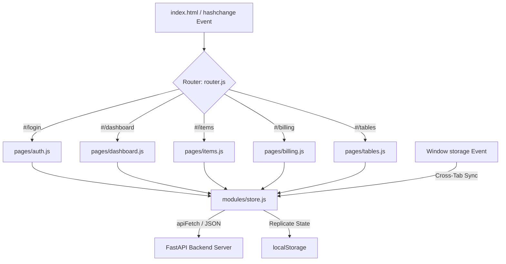

# Frontend Architecture & Technical Design Audit
**Project Component**: NexWare-ERP Frontend SPA  
**Audit Date**: May 28, 2026  
**Auditor**: Senior Software Architect & Systems Analyst  

---

## 1. Architectural & Executive Summary
The NexWare-ERP frontend is built as a lightweight, lightning-fast Single Page Application (SPA) utilizing a modern implementation of **Vanilla JavaScript** (ES6+), custom CSS layout primitives, and modular routing. Unlike typical modern SaaS dashboard solutions that rely on heavy web frameworks (like React, Angular, or Vue) which introduce extensive node dependencies and virtual DOM overhead, this project implements a specialized **Hash-based Client Router** and **Imperative DOM rendering system**.

While this approach guarantees zero runtime framework overhead and stellar baseline browser performance, it introduces significant technical debt and scalability limitations regarding long-term state synchronization, view state reactivity, and code maintainability.

### 🥇 Overall Frontend Architecture Score: **7.8 / 10**

---

## 2. Detailed Component & Routing Evaluation



### Component Structure
The project divides its view modules logically under `js/pages/`, keeping visual concerns separate:
*   `js/pages/dashboard.js`: The central analytical view, handling stock status, transaction tallies, and KPI metrics.
*   `js/pages/items.js`: Manages inventory CRUD, integrating dynamic filter search and SKU verification boundaries.
*   `js/pages/billing.js`: Implements checkout invoices, applying tax configurations and real-time total calculations.
*   `js/pages/tables.js`: Implements custom dynamic spreadsheet schemas, letting users add runtime custom columns.
*   `js/pages/workforce.js` & `settings.js`: Handles user invitations, tenant parameters, and notification toggles.

### Routing System (`router.js`)
*   **Mechanism**: A custom `HashRouter` that listens to window `hashchange` and `load` events.
*   **Authentication Guard**: Intercepts routing changes. If the target view is protected and `localStorage.getItem('access_token')` is absent, the router silently redirects to `#/login` without rendering the content.
*   **Assessment**: The router is highly functional and clean. However, it lacks nested route parsing (e.g. `#/items/:id`) or structured route parameters out of the box, meaning detailed item-level drill-downs have to be simulated using client-side modal overlays.

---

## 3. State Management & Data Flow

State management is handled in `js/modules/store.js` using a central, in-memory reactive data structure `_store` combined with `localStorage` for cache persistence and browser synchronization.

### Key Implementation Strengths:
1.  **Cross-Tab State Synchronization**: 
    The store listens to the window `storage` event. If a user modifies the inventory in one browser tab, other open tabs instantly catch the event, deserialize the new JSON payload, and trigger a `wareops_storage_sync` event, forcing safe UI updates:
    ```javascript
    window.addEventListener('storage', (e) => {
      if (e.key === STORAGE_KEY && e.newValue) {
        _store = JSON.parse(e.newValue);
        window.dispatchEvent(new CustomEvent('wareops_storage_sync'));
      }
    });
    ```
2.  **Robust Normalization Layer**: 
    Implements a robust `normalize()` utility that translates MongoDB’s native `_id` into standardized frontend `id` keys, bridging database conventions with clean JS object accesses.
3.  **Real-Time Data Broker**: 
    Implements active WebSockets to receive instant change notifications from MongoDB streams, automating client updates via `syncWithBackend()`.

---

## 4. Problems & Hidden Architectural Issues Found

### 🔴 Problem 1: Manual Imperative DOM Rebuilding (Low Maintainability)
*   **Root Cause**: The lack of a virtual DOM or dynamic data-binding engine (like Vue's reactivity or React's fiber) forces each page module to manually build and inject massive raw string templates into `innerHTML` whenever the store updates.
*   **Risk Level**: **High**
*   **Technical Debt**: Adding new interactive fields requires writing extensive template strings, manual event listener attachments, and redundant query selectors, which are highly error-prone.

### 🟡 Problem 2: Session Expiration Forced-Logout Routing
*   **Root Cause**: If the FastAPI server returns a `401 Unauthorized` during background synchronization, `apiFetch` clears local storage and forcibly redirects the user to the login screen.
*   **Risk Level**: **Medium**
*   **Technical Debt**: Users working on complex dynamic tables or filling out long billing invoices can lose all unsaved local forms instantly if their session expires mid-operation, as there is no local pre-refresh or session lock overlay warning.

---

## 5. Improvement & Roadmap Recommendations

1.  **Introduce Custom Template Renderer / Escaper**:
    Create a custom HTML sanitizer helper `html` (similar to Lit-HTML or basic DOMPurify) to secure imperative template injections from XSS vulnerabilities.
2.  **Add a Local Form Auto-Save Handler**:
    Persist drafts of active billing invoices or dynamic table configurations in a secondary `localStorage` key so that if the user gets logged out or reloads, their unsaved work can be safely recovered.
3.  **Future Framework Transition Plan**:
    When the ERP scales past 20 functional modules, transition the vanilla code to a reactive structure (such as React, Vue, or Next.js) using the migration steps defined in the global improvements roadmap.
